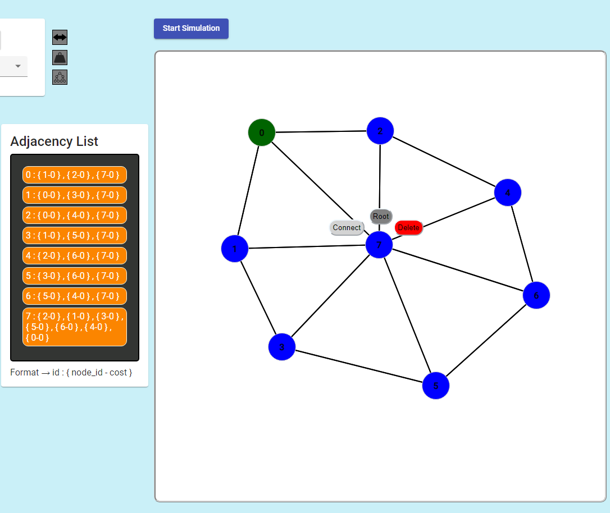
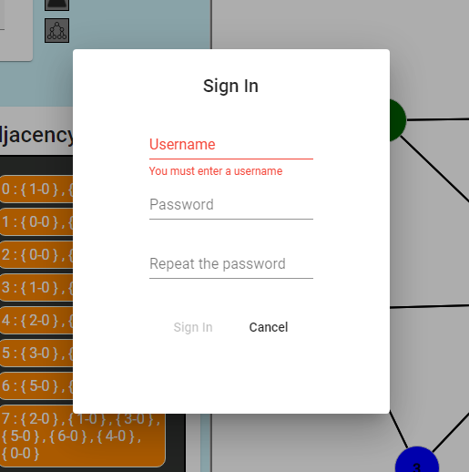
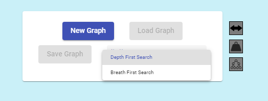
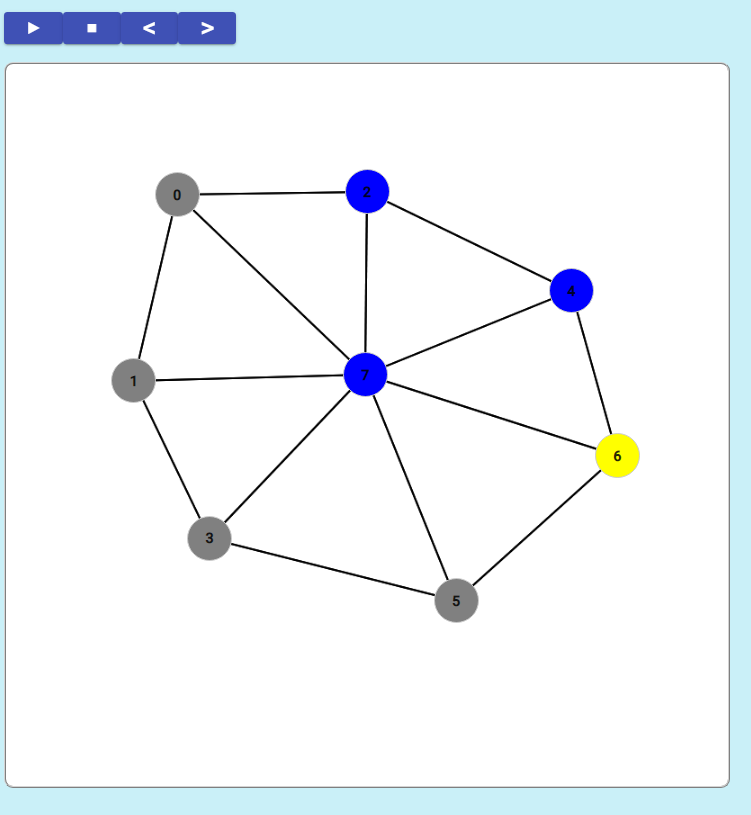
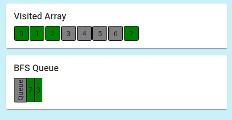

# Interactive Graph Theory
This project is the first version of an interactive graph theory website where people with no previous knowledge about graph theory can learn how a graph is structured and about its related listing, finding, sorting algorithms through real-time animated simulations.

## Interactive Panel
This panel allows the users to create their own graph in an easy and user-friendly way, just using the mouse to create new nodes, drag to move them around or create connections between them. While the user is creating a graph, its adjacency list (a way of representing graphs) will be displayed in real time.

## Sign in / Log in
Users are able to register directly from the website and they will be logged until they decide to log out or a significant amount of time has past.

## Load/Save functionalities
Logged users will be able to load and save their graph creations with just a click.

## Selecting an algorithm
Once the graph design is ready, the user can select the algorithm he/she is more interested in, and the related pseudo-code will be displayed on the left panel.

## Real-Time Simulation
The user can select to manually go through each step of the algorithm simulation or start the automatic simulation. It will start coloring the different nodes depending on wether they have been visited, are being visited or haven't been visited yet by the algorithm. 

## Real-Time Data
Depending on the algorithm, different data will be displayed while the simulation is running, for example the visited array associated with the algorithm.

